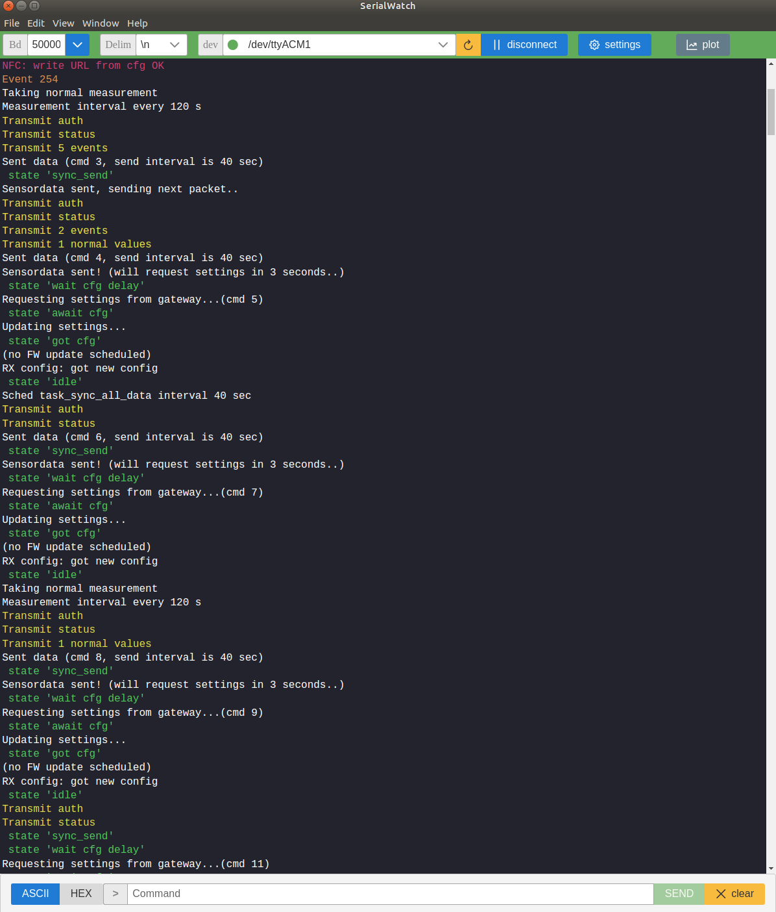
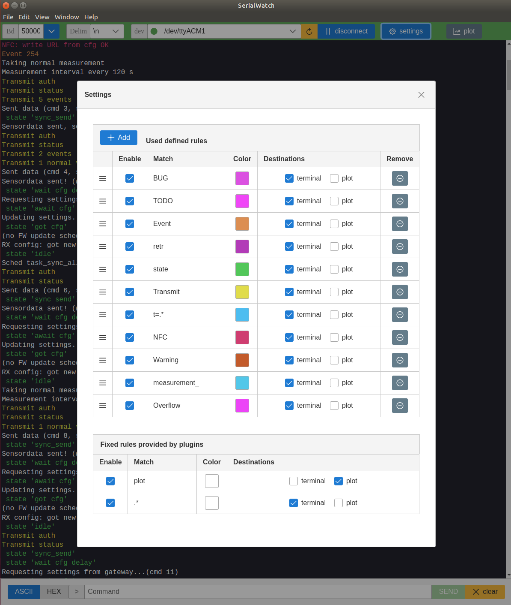

![Maintained][maintained-badge]
[![Make a pull request][prs-badge]][prs]
[](LICENSE.md)

# SerialWatch: Introduction

Serial console to assist embedded development. Most important features:

* Auto reconnect to serial port. You can plug out and in your device and it will automatically try to reconnect if you were already connected before.
* Plot plugin. See real time plots and text ouput in the same window.
* Use matching rules to filter lines and assign colors to certain patterns. For example, match lines that contain 'error' and assign red.

Serialwatch | settings |
--|--
 | 

## Default match rules:

Match rules work on incomming lines of text. It's aplpied as a regex match. If there is a match, the line will propagate to the selected destinations (modules/plugings). Rules are applied from top to bottom. The first match wins.

There are a few default rules built in to make sure SerialWatch works out of the box:

Rule | Plugin | Description
--- | --- | ---
`plot` | Plot | Direct all lines starting with `plot` to the plot module (and not to the terminal)
`.*` | Terminal | Wildcard: by default everything that has not been matched yet will go to the terminal |


# Development

[](https://angular.io/) [](https://electronjs.org/)

Currently runs with:

- Angular v11
- Electron v11
- Node v12 or higher

## Getting Started

Clone this repository locally :

``` bash
git clone https://github.com/devboard-io/SerialWatch.git
```

Install dependencies with npm :

``` bash
# for exact package-lock deps:
npm ci
# or:
npm install
```

## To build and run for development

- **in a terminal window** -> npm start

You can disable "Developer Tools" by commenting `win.webContents.openDevTools();` in `main.ts`.

## Dev Commands

|Command|Description|
|--|--|
|`npm run build`| Build the app. Your built files are in the /dist folder. |
|`npm run build:prod`| Build the app with Angular aot. Your built files are in the /dist folder. |
|`npm run electron:local`| Builds your application and start electron
|`npm run electron:build`| Builds your application and creates an app consumable based on your operating system |

**The application is optimised. Only /dist folder and node dependencies are included in the executable.**

## Build as a standalone app for easy use:

Run `npm run build:prod`. If all goes well this will output a bundled executable for your OS. You can move this executable to e.g. the Applications folder (on MacOS).

# Acknowledgments

This app is based on [Angular-Electron starter](https://github.com/maximegris/angular-electron) by Maxime Gris. This made it very easy to get up and running with Electron and Angular.

[license-badge]: https://img.shields.io/badge/license-Apache2-blue.svg?style=style=flat-square
[license]: https://github.com/devboard-io/serialwatch/blob/master/LICENSE.md
[prs-badge]: https://img.shields.io/badge/PRs-welcome-brightgreen.svg?style=flat-square
[prs]: http://makeapullrequest.com
[maintained-badge]: https://img.shields.io/badge/maintained-yes-brightgreen
